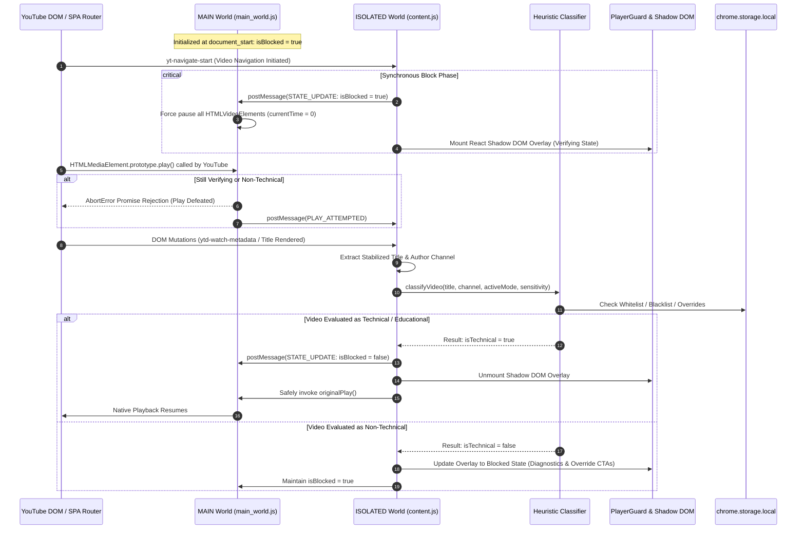
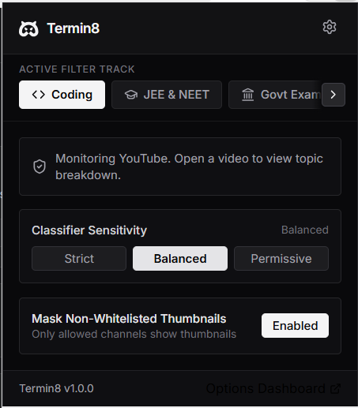
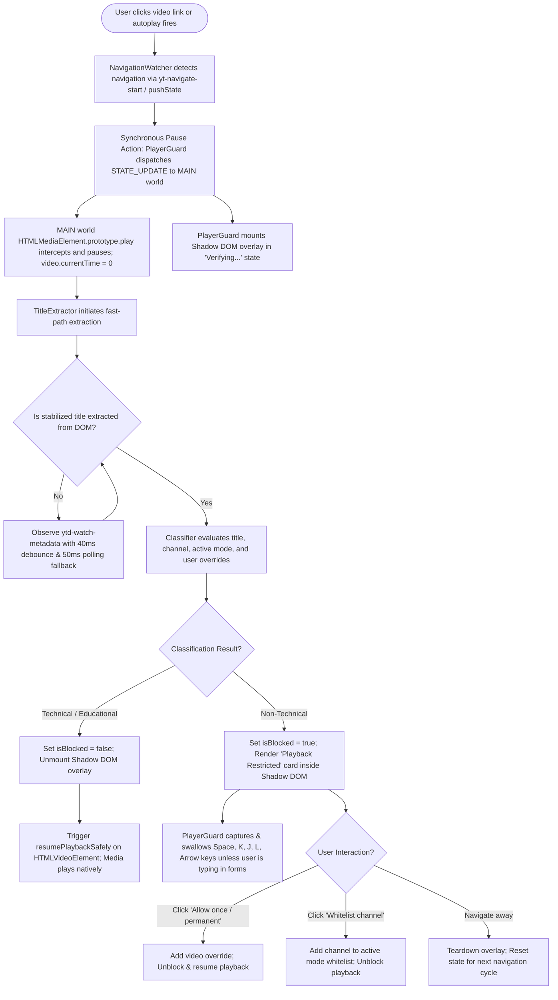

# Termin8 — YouTube Distraction Terminator

<div align="center">

[](https://developer.chrome.com/docs/extensions/mv3/intro/)
[](https://www.typescriptlang.org/)
[](https://react.dev/)
[](https://vitejs.dev/)
[](https://tailwindcss.com/)
[](https://opensource.org/licenses/MIT)

**A deterministic, zero-latency browser runtime engine designed to enforce deliberate video consumption on YouTube by intercepting media playback, sanitizing algorithmic recommendation feeds, and restricting content strictly to educational and technical domains.**

<p align="center">
  <a href="https://drive.google.com/file/d/1Cza9FIV_lh906EAakS976xwNCtH6z-Js/view?usp=sharing">
    
  </a>
  <a href="#path-a-quick-install-via-google-drive-no-build-required">
    
  </a>
  <a href="https://www.linkedin.com/in/sandeep-kumar-s21">
    
  </a>
  <a href="https://github.com/sandeep-kumar-21">
    
  </a>
</p>

</div>

---

## 1. Executive Overview & Mission

### The Modern Distraction Engine
YouTube operates one of the most sophisticated algorithmic recommendation loops in distributed computing. Optimized entirely for session retention and watch-time maximization, its recommendation surfaces—spanning the homepage infinite scroll, related video sidebars, Shorts carousels, and silent autoplay hover previews—create persistent cognitive friction for software engineers, students, and self-directed researchers attempting to use the platform as a technical resource.

A single search for an architectural pattern or data structures lecture inevitably exposes users to hyper-stimulating clickbait, sensationalized reaction clips, algorithmic entertainment traps, and Shorts rabbit holes. Standard site blockers employ heavy-handed, coarse domain blocking (`*.youtube.com`), cutting off access to world-class academic lectures, framework deep dives, and conference teardowns.

### The Termin8 Objective
**Termin8** solves this friction by converting YouTube from an algorithmic entertainment casino into a dedicated, distraction-free technical learning workbench. Rather than blocking YouTube entirely, Termin8 operates as an in-browser policy enforcement engine directly inside the Chromium execution pipeline.

Built strictly under **Manifest V3**, Termin8 enforces three core architectural mandates:
1. **Zero Playback Leaks**: Non-technical videos are halted at `0:00` across cold page loads, client-side Single Page Application (SPA) navigations, Shorts swipe transitions, and background autoplay queues.
2. **Feed Sanitization (Visual Masking)**: Algorithmic recommendation thumbnails from non-whitelisted channels are masked with an opaque, theme-synchronized shield overlay across all grids, sidebars, and carousels, eliminating visual temptation before interaction occurs.
3. **Multi-Track Curricula**: Termin8 ships with eight pre-compiled academic and technical tracks (Coding, IIT-JEE/NEET, Government Exams, College Academics, Deep Focus, K-12 Board Exams, CUET, and Custom), evaluated by a local heuristic scoring classifier executing in sub-millisecond memory space with zero cloud dependencies.

### Target Browser Environments
Termin8 is engineered and validated across all modern Chromium environments adhering to the W3C WebExtensions Manifest V3 specification:
* **Google Chrome** (v108+)
* **Microsoft Edge** (v108+)
* **Brave Browser** (v1.46+)
* **Arc Browser** & Chromium forks

---

## 2. Technical Architecture & System Topography

Termin8 employs a multi-tiered, asynchronous architecture that separates the webpage's native JavaScript execution realm from the extension's privileged runtime environment.

```
┌────────────────────────────────────────────────────────────────────────────────────────┐
│                                   BROWSER PROCESS                                      │
├────────────────────────────────────────────────────────────────────────────────────────┤
│  SERVICE WORKER (background.js)                                                        │
│  - chrome.runtime Lifecycle Orchestration                                              │
│  - Action Badge State Synchronization (ON / OFF)                                       │
│  - First-Run Onboarding Routing (welcome.html)                                         │
│  - Runtime Message Dispatcher & Diagnostic Logging Storage                             │
└───────────────┬────────────────────────────────────────────────────────▲───────────────┘
                │                                                        │
         Storage Sync Events                                      Runtime Messages
                │                                                        │
┌───────────────▼────────────────────────────────────────────────────────┴───────────────┐
│  PAGE ENVIRONMENT (YouTube Tab)                                                        │
│                                                                                        │
│  ┌────────────────────────────────────────┐   PostMessage Bridge   ┌─────────────────┐ │
│  │ MAIN WORLD (main_world.js)             │◄──────────────────────►│ ISOLATED WORLD  │ │
│  │ - document_start execution             │   Strict Event Schema  │ (content.js)    │ │
│  │ - HTMLMediaElement.prototype.play patch│                        │                 │ │
│  │ - Window Capture-Phase play/playing    │                        │                 │ │
│  │ - Default: isBlocked = true            │                        │                 │ │
│  │ - Feed Preview Video Freezer           │                        │                 │ │
│  └────────────────────────────────────────┘                        │                 │ │
│                                                                    │                 │ │
│  ┌──────────────────────────────────────────────────────────────┐  │                 │ │
│  │ CONTENT ORCHESTRATION ENGINE                                 │  │                 │ │
│  │ ├─ NavigationWatcher (yt-navigate-*, History API, Shorts)    │◄─┤                 │ │
│  │ ├─ TitleExtractor (MutationObserver, Debounce, Retry Cache)  │  │                 │ │
│  │ ├─ Heuristic Classifier (8 Modes, Regex, Category Weights)  │  │                 │ │
│  │ ├─ PlayerGuard (State Machine, Keyboard Key Interception)   │  │                 │ │
│  │ ├─ ThumbnailGuard (Card DOM Scanner, Channel Handle Matcher) │  │                 │ │
│  │ └─ Shadow DOM Overlay Mount (React 19 Root, Isolated CSS)    │  │                 │ │
│  └──────────────────────────────────────────────────────────────┘  └─────────────────┘ │
└────────────────────────────────────────────────────────────────────────────────────────┘
```

### Dual-World Execution Model
Chromium's isolated world architecture prevents content scripts from mutating objects in the host webpage's execution context. However, blocking media playback before YouTube's internal player scripts initialize requires modifying the page's native prototypes. Termin8 resolves this via a cooperative dual-world bridging architecture:

1. **The `MAIN` World Script (`main_world.js`)**:
   - Injected at `document_start` with `"world": "MAIN"`, granting direct access to the webpage global `window` and JavaScript prototypes.
   - Monkey-patches `HTMLMediaElement.prototype.play` and caches `HTMLMediaElement.prototype.pause`.
   - Attaches capture-phase event listeners to `window` for `play` and `playing` events.
   - **Critical Security Paradigm**: Boots with internal state `isBlocked = true` by default. If YouTube's player invokes `.play()` during initial script load before the classifier finishes parsing metadata, the call is rejected immediately via a cleanly handled `DOMException('Playback restricted by Termin8', 'AbortError')`, and `video.currentTime` is clamped to `0`.

2. **The `ISOLATED` World Controller (`content.js`)**:
   - Injected at `document_start` with `"world": "ISOLATED"`, granting full access to `chrome.storage`, `chrome.runtime`, and standard WebExtensions APIs without exposing them to malicious web scripts.
   - Manages the extension lifecycle, DOM observers, title stabilization, heuristic evaluation, and React Shadow DOM mounting.

3. **Strict Window PostMessage Communication Bridge**:
   - Cross-world messaging between `main_world.js` and `content.js` communicates over `window.postMessage`.
   - **Sender & Origin Validation**: Both contexts enforce strict origin validation (`event.source === window`) and require a deterministic payload envelope (`event.data.source === 'techonly-isolated' | 'techonly-main'`), fully isolating extension traffic from YouTube's internal window messages.



---

## 3. Complete Feature Catalog

### 1. In-Player Guard & Shadow DOM Overlay Engine
When non-technical content is detected, Termin8 completely covers the video display with an isolated, dark-zinc visual card rendered inside an encapsulated **Shadow Root** (`#techonly-shadow-host`).

* **Zero CSS Collision via Shadow Root (`mode: open`)**: The overlay card and its complete CSS stylesheet are injected inside a private shadow root attached to `#movie_player` or `ytd-reel-video-renderer[is-active]`. YouTube's sprawling global stylesheets cannot leak in to distort styling, and Termin8's rules cannot inadvertently restyle YouTube's UI.
* **Responsive Container Queries (`@container`)**: Using native CSS container queries, the overlay dynamically reflows across wide cinema viewports, vertical portrait YouTube Shorts reels (`max-width: 440px`), and tiny YouTube Miniplayers (`max-height: 280px`).
* **Keyboard Navigation Interceptor**: Standard YouTube shortcuts (`Space`, `k`, `j`, `l`, `0-9`, `ArrowLeft`, `ArrowRight`, `Home`, `End`) are intercepted during capture-phase dispatch and prevented from resuming media.
  * **Input & Comment Field Protection**: The event listener evaluates `event.target`. If the user is typing into search inputs (`ytd-searchbox`, `#search`), comment fields (`#contenteditable-root`, `textarea`), or any element with `contenteditable="true"`, keystrokes pass through unimpeded.
* **Miniplayer Dismissal Hook**: Integrates directly with YouTube's miniplayer controller. When the overlay's dismiss button is clicked inside miniplayer mode, it automatically triggers YouTube's internal `.ytp-miniplayer-close-button` element to clean up the screen.
* **Interactive Diagnostics**: An expandable "Why was this blocked?" disclosure widget surfaces the exact algorithm decision: net score, sensitivity threshold, matched topical categories, and identified penalty terms.

### 2. Algorithmic DOM Masking & Recommendation Sanitizer (`ThumbnailGuard`)
Algorithmic clickbait relies heavily on thumbnail artwork. Termin8 includes a specialized DOM masking subsystem that sweeps recommendation surfaces and shields thumbnails before the user can process the imagery.

* **Target Surface Coverage**: Scans over 30 distinct YouTube element selectors, including `ytd-rich-item-renderer` (Home Feed), `ytd-compact-video-renderer` (Up Next / Sidebar recommendations), `ytm-shorts-lockup-view-model-v2` (Shorts grid), `ytd-video-renderer` (Search results), and recommendation shelves.
* **Authoritative Channel Attribution**: Algorithmic video titles frequently include `@mentions` of famous tech channels (e.g., `"Why I left tech @freecodecamp"`). The `ThumbnailGuard` parser isolates author attribution strictly to dedicated DOM containers (`ytd-channel-name`, `#byline-container`, handle anchor links `a[href*="/@"]`, and avatar image `aria-label` attributes), eliminating false-positive whitelist matches caused by title mentions.
* **Subpixel Anti-Bleed Architecture**: To prevent the underlying video thumbnail from momentarily flashing around rounded CSS corners, the guard enforces:
  ```css
  html[data-termin8-mask-active="true"] [data-termin8-masked="true"] img,
  html[data-termin8-mask-active="true"] [data-termin8-masked="true"] yt-img-shadow,
  html[data-termin8-mask-active="true"] [data-termin8-masked="true"] .yt-core-image {
    opacity: 0 !important;
  }
  ```
* **Performance-First Batching**: Operates via a single root-level `MutationObserver` paired with `requestAnimationFrame` debouncing. Cards are tagged with `data-termin8-channel-checked="true"` to prevent duplicate DOM queries, achieving 60 FPS scrolling with zero frame drop.
* **Tri-Theme Engine**: Supports `auto` (auto-detects YouTube DOM dark attributes and `prefers-color-scheme`), `dark` (`#121214`), and `light` (`#f8fafc`).

### 3. The 8-Track Multi-Curriculum Engine
Termin8 features an extensible multi-track architecture. Rather than enforcing a monolithic developer-only dictionary, users select a learning focus track with pre-configured whitelists and keyword weightings:

| Mode ID | Track Name | Target Audience & Academic Scope | Inheritance |
|:---|:---|:---|:---|
| `coding` | **Coding Mode** | Full-stack development, DSA, LeetCode, system design, low-level architecture, cloud, DevOps, AI/ML, OS internals, web security. | *Root Track* |
| `jee_neet` | **JEE & NEET Mode** | IIT-JEE (Main & Advanced) and NEET-UG coaching. Physics, Organic/Inorganic Chemistry, Calculus, Botany, Zoology, PYQs, one-shots. | Standalone |
| `govt_exam` | **Govt Exam (Sarkari)** | UPSC CSE, SSC CGL/CHSL, Banking (IBPS/SBI), State PSC. Indian Polity, Constitution, Static GK, Quantitative Aptitude, Devanagari Hindi terms. | Standalone |
| `college` | **College Mode** | Engineering branches (Mechanical, Civil, Electrical), B.Com, Corporate Accounting, Constitutional Law, MBBS Academics. | Inherits `coding` |
| `focus` | **Focus Mode** | Aggressive deep work and anti-distraction. Allows documentary lectures and study protocols; penalizes clickbait and viral entertainment. | Standalone |
| `school` | **School Mode** | K-12, CBSE, ICSE, NCERT syllabus, Class 6–12 board exam revision, standard sciences, and school mathematics. | Standalone |
| `cuet` | **CUET Mode** | Common University Entrance Test (UG & PG) prep, NTA domain subjects, General Test aptitude, university admission strategies. | Inherits `school` |
| `custom` | **Custom Mode** | Blank slate. Video playback and feed displays are governed 100% by user-defined custom allow/deny rules and whitelists. | Pure User Rules |

### 4. Advanced Heuristic Scoring Classifier
At the core of Termin8 is an in-memory scoring engine (`classifier.ts`) that scores incoming video metadata in `< 1ms`:

$$\text{Final Score} = \sum (\text{Topic Matches} \times 2) + \min(\text{Educational Modifiers}, 2) - \sum \text{Penalties}$$

1. **Title Normalization**: Strips Unicode emojis, replaces special delimiters (`|`, `•`, `—`, `_`, `[ ]`, `( )`) with normalized whitespace, and preserves bracketed sub-clauses for analysis.
2. **Boundary-Safe Symbol Regex**: Standard regex `\b` fails on programming tokens containing punctuation. Termin8 constructs specialized boundary patterns for edge cases:
   - `c++` / `cpp`: `/(?:^|[\s,.\-/'"(])c\+\+(?:$|[\s,.\-/'")])/i`
   - `c#` / `csharp`: `/(?:^|[\s,.\-/'"(])c#(?:$|[\s,.\-/'")])/i`
   - `.net`: `/(?:^|[\s,/'"(])\.net(?:\s+core)?(?:$|[\s,.\-/'")])/i`
   - `big-o` / `o(n)`: `/(?:^|[\s,/'"(])(?:big[\s-]?o|o\([a-z0-9\s+\-*^]+\))(?:$|[\s,.\-/'")])/i`
   - Isolated `c` / `r`: Requires compound indicators (e.g. `c programming`, `r language`, `r script`).
   - Devanagari Hindi: Unicode-aware matching for Indian educational content (`सरकारी नौकरी`, `परीक्षा`, `सामान्य ज्ञान`).
3. **Threshold Calibration**:
   - **Strict (3)**: Requires either 2 distinct core topic hits or 1 core topic + modifier hit while rejecting any penalties.
   - **Balanced (2 - Default)**: Requires 1 strong topic hit or combination matches.
   - **Permissive (1)**: Permits playback if any educational modifier or weak topic indicator is detected.
4. **Precedence Hierarchy**:
   ```
   Channel Whitelist (Pass, Score 10)
     └── Channel Blacklist (Block, Score -10)
           └── Permanent Video Allowlist Override (Pass, Score 10)
                 └── Custom Deny Keywords (Block, Score -5)
                       └── Custom Allow Keywords (Pass, Score 10)
                             └── Topic Scoring & Threshold Check
   ```

### 5. Options Dashboard & Extension Popup
* **Popup View (`popup.html`)**: Instant state inspector displaying active mode, active tab video evaluation, classification reason, sensitivity toggles, and direct CTAs ("Allow once", "Whitelist channel").
* **Options Dashboard (`options.html`)**: A production-grade settings application containing:
  - **General Tab**: Global settings, active track selector, master switch, hover preview blocker, thumbnail masking theme, and video override persistence policies (`once` vs `always`).
  - **Channel Rules Tab**: Searchable directory of user whitelists, user blacklists, and hundreds of built-in verified technical channels. Also displays all permanently allowed video IDs.
  - **Custom Keywords Tab**: Manage per-mode user-defined allow and deny keyword filters.
  - **Built-in Dataset Tab**: Searchable transparency inspector for all embedded keywords and inherited track terms.
  - **Classification Log Tab**: Real-time diagnostic log of the last 50 decisions made by the classifier across watch pages, Shorts, and previews.
* **First-Run Welcome Page (`welcome.html`)**: Automatic onboarding tab launched upon first install (`chrome.runtime.onInstalled`), guiding users to pick their primary focus track before browsing.

---

## 4. UI & Visual Architecture Gallery

<div align="center">

### Active DOM Masking in Action


*Algorithmic YouTube recommendations sanitized with opaque theme-synchronized shield overlays on non-whitelisted creators, while educational channels like Apna College and KodeKloud stream uninterrupted.*

---

### Extension Interface & Configuration Views

| Termin8 Popup Interface | Options Dashboard — General Settings |
|:---:|:---:|
|  |  |
| *Live status inspector showing real-time video evaluation, sensitivity switches, and active track selector.* | *Global preferences, classification sensitivity calibration, thumbnail masking theme, and override persistence policies.* |

| Options Dashboard — Channel Rules | Options Dashboard — Custom Keywords |
|:---:|:---:|
|  |  |
| *Granular per-mode whitelist and blacklist rules with real-time channel search and permanent video overrides.* | *User-defined custom allow (pass) and deny (block) keyword rules overriding automated scoring.* |

| Options Dashboard — Built-in Topic Dataset | Options Dashboard — Classification Diagnostic Logs |
|:---:|:---:|
|  |  |
| *Transparent inspector for embedded zero-latency topic definitions, keywords, and track inheritance.* | *Real-time evaluation audit log tracking scores, surfaces, reasons, and decisions across tabs.* |

</div>

---

## 5. Granular Project Directory Structure

```
Termin8/
├── .oxlintrc.json                 # Oxlint configuration for high-performance static analysis
├── package.json                   # NPM manifest (scripts, React 19, Vite, Lucide, TypeScript)
├── package-lock.json              # Deterministic dependency lockfile
├── tsconfig.json                  # Root TypeScript project references configuration
├── tsconfig.app.json              # TypeScript compilation rules for extension source code
├── tsconfig.node.json             # TypeScript configuration for Node.js build tooling
├── vite.config.ts                 # Base Vite configuration
├── popup.html                     # HTML mount point for extension action popup
├── options.html                   # HTML mount point for full-page options dashboard
├── welcome.html                   # HTML mount point for first-run onboarding screen
│
├── images/                        # Production UI & operational walkthrough screenshots
│   ├── dom-mask-preview.png       # Live YouTube home feed showing active thumbnail masking
│   ├── popup.png                  # Termin8 popup interface showing active status and sensitivity
│   ├── options-general.png        # Options dashboard: global settings, mode track, override mode
│   ├── options-channels.png       # Options dashboard: per-mode whitelists and blacklists
│   ├── options-keywords.png       # Options dashboard: custom allow/deny rules
│   ├── options-dataset.png        # Options dashboard: built-in curriculum topic dataset
│   └── options-logs.png           # Options dashboard: real-time classification diagnostic logs
│
├── public/                        # Static extension assets copied directly to build output
│   ├── manifest.json              # W3C Manifest V3 declaration (permissions, worlds, resources)
│   ├── favicon.svg                # Browser favicon
│   ├── logo.svg                   # Vector SVG brand icon
│   ├── mask.svg                   # Vector mask graphic
│   ├── mask-dark.svg              # Dark theme thumbnail mask SVG
│   ├── mask-light.svg             # Light theme thumbnail mask SVG
│   ├── icons.svg                  # Consolidated SVG sprite asset
│   └── icons/                     # Generated extension icons
│       ├── icon16.png             # 16x16 toolbar icon
│       ├── icon48.png             # 48x48 extensions manager icon
│       └── icon128.png            # 128x128 Chrome Web Store / high-DPI icon
│
├── scripts/                       # Build automation & developer verification tooling
│   ├── build.js                   # Custom multi-target Vite/Rollup IIFE & ES module bundler
│   ├── generate-icons.js          # Pure Node.js script generating PNG icons from vector paths
│   └── test-classifier.ts         # Automated test suite validating classification rules
│
└── src/                           # Extension application source code
    │
    ├── background/                # Background Service Worker context
    │   └── service-worker.ts      # MV3 event listeners, action badge sync, onboarding launcher
    │
    ├── content/                   # Content scripts executing in page environments
    │   ├── index.ts               # ISOLATED world orchestrator & lifecycle manager
    │   ├── main-world.ts          # MAIN world script: HTMLMediaElement.prototype.play interceptor
    │   ├── navigation-watcher.ts  # SPA routing watcher (yt-navigate-*, History API, Shorts reel observer)
    │   ├── title-extractor.ts     # Multi-selector, debounced MutationObserver title resolver
    │   ├── classifier.ts          # Multi-track heuristic classifier, regex builder & scoring engine
    │   ├── player-guard.ts        # Layered playback guard, keyboard interceptor & bridge controller
    │   ├── thumbnail-guard.ts     # Recommendation feed scanner, card DOM parser & mask manager
    │   ├── thumbnail.css          # CSS styles injected for thumbnail masking & subpixel protection
    │   └── overlay/               # In-player Shadow DOM overlay subsystem
    │       ├── mountOverlay.ts    # Shadow DOM creation, container query styles & React root mount
    │       └── Overlay.tsx        # React 19 blocking card component with expandable diagnostics
    │
    ├── popup/                     # Browser Action Popup UI
    │   ├── main.tsx               # React 19 root bootstrap for popup.html
    │   ├── Popup.tsx              # Live popup interface (status, sensitivity, quick allow, track switch)
    │   └── popup.css              # Tailwind CSS entrypoint for popup
    │
    ├── options/                   # Options & Preferences Dashboard UI
    │   ├── main.tsx               # React 19 root bootstrap for options.html
    │   ├── Options.tsx            # Options shell (two-column layout, navigation sidebar, notifications)
    │   ├── options.css            # Tailwind CSS entrypoint for options dashboard
    │   └── tabs/                  # Modular options tabs
    │       ├── GeneralTab.tsx     # Global settings, sensitivity slider, theme, override duration
    │       ├── ChannelsTab.tsx    # Channel whitelists, blacklists, built-in list & search
    │       ├── KeywordsTab.tsx    # Custom allow/deny keyword rules manager
    │       ├── KeywordCard.tsx    # Reusable card component for keyword tag displays
    │       ├── DatasetTab.tsx     # Searchable transparency inspector for built-in track keywords
    │       └── LogsTab.tsx        # Real-time diagnostic logging feed with search and filters
    │
    ├── welcome/                   # First-Run Onboarding Flow UI
    │   ├── main.tsx               # React 19 root bootstrap for welcome.html
    │   ├── Welcome.tsx            # Track selection grid and initial setup wizard
    │   └── welcome.css            # Tailwind CSS entrypoint for welcome screen
    │
    ├── shared/                    # Code shared across all extension execution contexts
    │   ├── types.ts               # Strict TypeScript definitions (settings, modes, bridge schemas)
    │   ├── storage.ts             # Type-safe chrome.storage.local wrapper with schema migrations
    │   ├── modes-data.ts          # Static keyword dictionaries & channel directory for all 8 tracks
    │   ├── keywords.ts            # Default technical keyword categorizations & legacy fallbacks
    │   ├── Logo.tsx               # Geometric Termin8 brand SVG component
    │   └── ModeSwitcher.tsx       # Reusable track selection control used across popup & options
    │
    └── assets/                    # Static visual assets for UI rendering
        ├── hero.png               # Visual graphic asset
        ├── react.svg              # React logo
        └── vite.svg               # Vite logo
```

---

## 6. End-to-End Execution Lifecycle Trace

Understanding how Termin8 handles execution race conditions requires tracing an end-to-end user navigation lifecycle:



### Trace Steps:
1. **Navigation Detection (`NavigationWatcher`)**:
   - The user clicks a related video or autoplay triggers. YouTube's internal SPA router fires the custom DOM event `yt-navigate-start` before the new document markup is rendered.
   - The `NavigationWatcher` immediately catches this event synchronously, along with monkey-patched `history.pushState` hooks.
2. **Immediate Synchronous Guard (`PlayerGuard`)**:
   - Before metadata extraction even begins, `PlayerGuard.handleNavigationStart(videoId)` dispatches a synchronous `STATE_UPDATE` to `main_world.js` over `window.postMessage`.
   - `main_world.js` resets `isBlocked = true` and immediately invokes native `originalPause()` on all `<video>` elements in the DOM, resetting `currentTime = 0`.
   - The React Shadow DOM overlay is mounted in a calm `"Verifying video topic..."` state.
3. **Stabilized Title Resolution (`TitleExtractor`)**:
   - YouTube frequently retains the *previous* video's title in the DOM for several hundred milliseconds during SPA swaps.
   - `TitleExtractor.extractStabilizedTitle()` employs a multi-tiered resolution pipeline: it queries prioritized DOM selectors (`h1.ytd-watch-metadata yt-formatted-string`, `yt-shorts-video-title-view-model h1`), verifies that the extracted title does not match the cached previous video title, applies a 40ms `MutationObserver` debounce, and polls at 50ms intervals with a 1200ms safety timeout.
4. **Heuristic Evaluation (`classifier.ts`)**:
   - The stabilized title and author channel are passed to `classifyVideo()`.
   - The engine checks channel whitelists, channel blacklists, custom keyword allow/deny lists, mode keywords, context modifiers, and penalty deductions.
5. **State Commitment & UI Transition**:
   - **If Allowed**: `content.js` sends `isBlocked = false` to `main_world.js`, unmounts the Shadow DOM overlay, and calls `resumePlaybackSafely()`. Normal playback resumes smoothly.
   - **If Blocked**: The Shadow DOM overlay transitions to `"Playback Restricted"`, surfacing the diagnostic breakdown and override controls. The capture-phase keyboard interceptor prevents `Space` or `k` from restarting playback.
6. **Diagnostic Logging (`addLogEntry`)**:
   - The classification result (score, threshold, matched keywords, reason, surface) is automatically committed to `chrome.storage.local` under `techonly_logs` (capped at the 50 most recent evaluations) for diagnostic inspection in the Options dashboard.

---

## 7. Engineering Depth & Manifest V3 Implementation Challenges

### 1. The Ephemeral Service Worker Problem
Under Manifest V2, background scripts ran as persistent, long-lived background pages holding state variables in memory indefinitely. Under Manifest V3, the background service worker is ephemeral: the browser terminates it after 30 seconds of inactivity to conserve system memory.

**How Termin8 Solves It**:
* **Completely Stateless Worker Design**: `src/background/service-worker.ts` maintains **zero in-memory operational state**. All settings, mode configs, and diagnostic logs are persisted asynchronously in `chrome.storage.local`.
* **Declarative Event Architecture**: All background operations run inside top-level event listeners registered synchronously during the initial evaluation cycle (`chrome.runtime.onInstalled`, `chrome.storage.onChanged`, `chrome.runtime.onMessage`).
* **Active Tab Self-Reliance**: The content script running inside the YouTube tab does not rely on the background service worker for classification or playback interception. The heuristic engine and storage cache execute locally in the tab's content script context, ensuring zero latency even if the service worker is currently dormant.

### 2. Dual-World Synchronization & Race-Condition Interception
YouTube’s internal initialization scripts are heavily optimized for streaming start speed, often calling `.play()` on embedded media elements before standard extension content scripts finish parsing the DOM.

**How Termin8 Solves It**:
* Both `main_world.js` and `content.js` declare `"run_at": "document_start"` in `manifest.json`.
* `main_world.js` executes before YouTube's application bundles mount. By patching `HTMLMediaElement.prototype.play` at the prototype level prior to application execution, YouTube's code cannot obtain an unpatched reference to the native media method.
* Initializing `isBlocked = true` by default guarantees that any race condition between YouTube's autoplay scripts and the extension's classifier results in a blocked state, completely eliminating "audio flashes" or momentary playback leaks.

### 3. DOM & CSS Encapsulation on Hostile Third-Party Markup
Injecting UI onto YouTube is notoriously fragile: YouTube regularly updates its Polymer web components, and global styles targeting `yt-*` elements often break extension UI layouts or cause extension styling to bleed into YouTube's interface.

**How Termin8 Solves It**:
* **Shadow DOM Isolation**: The in-player blocking overlay mounts inside a completely detached Shadow Root (`element.attachShadow({ mode: 'open' })`). The internal layout uses CSS container queries (`@container`) and CSS variables, remaining entirely immune to YouTube's host styling.
* **Inline Scoped Style Tagging**: For thumbnail masking on the host DOM, Termin8 injects an idempotent `<style id="termin8-thumbnail-styles">` tag using strict utility classes prefixed with `.termin8-*` and explicit `!important` declarations, preventing YouTube stylesheet rules from overriding mask visibility.

### 4. Storage Partitioning & Cross-Tab Synchronization
Users frequently operate multiple YouTube tabs concurrently across different browser windows, while modifying settings or whitelisting channels in the Options dashboard or Popup.

**How Termin8 Solves It**:
* **Per-Mode Partitioned Schema**: Settings are structured with clean partitioning:
  ```typescript
  export interface ExtensionSettings {
    enabled: boolean;
    activeMode: ModeId;
    sensitivity: SensitivityLevel;
    modeConfigs: Record<ModeId, PerModeConfig>;
    allowlistOverrides: Record<string, { title?: string; timestamp: number } | number>;
    // ...
  }
  ```
* **Reactive Storage Observer**: The content controller binds to `onSettingsChanged()`, which wraps `chrome.storage.onChanged`. When an option is modified anywhere (such as toggling thumbnail masking in the popup), all open YouTube tabs receive the updated settings object instantaneously, update their internal player guards, and trigger an immediate re-evaluation without requiring a page reload.

---

## 8. Installation & Quick Start Guide

You can install Termin8 either by downloading the pre-built release package directly from Google Drive (recommended for recruiters, hiring managers, and quick testing), or by building the source bundle locally.

---

### Path A: Quick Install via Google Drive (No Build Required)

*Recommended for immediate evaluation, reviewers, and non-developers. No Node.js or terminal required.*

1. **Download the Pre-Compiled Build Package**:
   Download the compiled extension bundle from Google Drive:
   👉 **[Download Termin8.zip from Google Drive](https://drive.google.com/file/d/1Cza9FIV_lh906EAakS976xwNCtH6z-Js/view?usp=sharing)**
   *(Extract the downloaded `Termin8.zip` archive to a permanent local path, e.g., `C:\Extensions\Termin8` or `~/Extensions/Termin8`)*.

2. **Verify Folder Contents**:
   Ensure the unzipped directory directly contains `manifest.json`, `background.js`, `content.js`, `main_world.js`, `popup.html`, and `options.html`.

3. **Install in Microsoft Edge**:
   1. Open Microsoft Edge and navigate to `edge://extensions/`.
   2. Turn on the **Developer mode** toggle in the left navigation sidebar.
   3. Click the **Load unpacked** button at the top of the window.
   4. In the folder browser dialog, select the extracted `Termin8` folder.
   5. Termin8 is now active! The onboarding setup screen (`welcome.html`) will automatically launch to select your focus track.

4. **Install in Google Chrome or Brave**:
   1. Open Google Chrome (or Brave) and navigate to `chrome://extensions/` (or `brave://extensions/`).
   2. Turn on the **Developer mode** toggle in the top-right corner.
   3. Click **Load unpacked** in the top-left toolbar.
   4. Select the extracted `Termin8` folder.
   5. Pin the Termin8 shield icon in your browser toolbar for instant access to the runtime status inspector.

---

### Path B: Build from Source (Developers)

*For software engineers who wish to inspect, customize, or compile the source code.*

#### Prerequisites
* **Node.js**: v18.0.0 or higher
* **Package Manager**: `npm` (v9.0.0+)
* **Chromium Browser**: Google Chrome, Microsoft Edge, or Brave

#### 1. Repository Setup & Dependencies
```bash
# Clone the showcase repository
git clone https://github.com/sandeep-kumar-21/Termin8.git
cd termin8

# Install dependencies (React 19, TypeScript, Vite, Oxlint)
npm install
```

#### 2. Run Test Suite & Static Analysis
```bash
# Run the automated classifier test suite (validates 30+ edge cases and tracks)
npx tsx scripts/test-classifier.ts

# Run high-performance linting via Oxlint
npm run lint
```

#### 3. Build the Extension Bundle
```bash
# Compiles TypeScript and builds production bundles via scripts/build.js
npm run build
```
The build pipeline outputs the compiled bundle directly to `dist/`:
- `dist/popup.html` & `dist/assets/` (React 19 Popup UI)
- `dist/options.html` & `dist/assets/` (React 19 Options Dashboard)
- `dist/welcome.html` & `dist/assets/` (React 19 Onboarding Page)
- `dist/background.js` (Background Service Worker ES Module)
- `dist/content.js` (ISOLATED World Content Script IIFE)
- `dist/main_world.js` (MAIN World Interceptor IIFE)
- `dist/manifest.json` & `dist/icons/` (Assets and WebExtensions manifest)

#### 4. Sideload the Compiled `dist/` Folder
Follow the same **Developer mode** -> **Load unpacked** instructions outlined above, selecting the generated `Termin8/dist` directory.

---

## 9. Comprehensive Manual Verification Checklist

The following test matrix validates all functional edge cases prior to store deployment:

| # | Test Scenario | Execution Procedure | Expected Behavior | Status |
|:---:|:---|:---|:---|:---:|
| **1** | **Direct Technical Watch Page Load** | Navigate directly to `youtube.com/watch?v=...` featuring a programming tutorial (e.g. "React 19 Server Actions"). | Brief verification state (< 150ms), title extracts, classifier scores above threshold, overlay clears, video plays natively. | **PASSED** |
| **2** | **Direct Non-Technical Video Load** | Navigate directly to a non-technical video (e.g. music video, vlog, gaming clip). | Instant pause at `0:00`, audio blocked, React Shadow DOM displays "Playback Restricted", spacebar/k cannot resume. | **PASSED** |
| **3** | **SPA Click-Through Sequence** | Click through 5+ consecutive related video links in the sidebar without browser refresh. | Each navigation synchronously pauses at `0:00`, extracts stabilized title, and accurately allows or restricts playback. | **PASSED** |
| **4** | **Mixed Autoplay Queue** | Allow YouTube autoplay to progress across a mixed playlist of educational and entertainment clips. | Educational videos stream uninterrupted; entertainment videos are stopped dead at `0:00` before first frame renders. | **PASSED** |
| **5** | **YouTube Shorts Carousel Scrolling** | Navigate to `youtube.com/shorts` and swipe rapidly through reels using keyboard arrow keys. | Active reel observer binds to active item; non-technical shorts are blocked; swiping to an educational short unblocks immediately. | **PASSED** |
| **6** | **Search & Comment Typing Safety** | Open a blocked video, focus the YouTube search bar or comment field, and type words containing `k`, `j`, `l`, `Space`. | Characters type smoothly into input fields; extension keydown interceptor never swallows active form inputs. | **PASSED** |
| **7** | **In-Player "Allow Once" Override** | Click "Allow once" on a restricted video card. | Overlay unmounts immediately, video resumes. Reloading the page re-evaluates and blocks the video again as expected. | **PASSED** |
| **8** | **Permanent Video ID Override** | Change override mode to "Permanent", click "Allow permanent" on a video. | Video unblocks. Video ID is saved to `allowlistOverrides` in storage; video remains allowed across subsequent refreshes. | **PASSED** |
| **9** | **Channel Whitelist Injection** | Click "Whitelist channel" on a blocked video. | Channel added to active track whitelist; overlay detaches; all future videos from that creator stream without restriction. | **PASSED** |
| **10** | **Thumbnail Masking Integrity** | Browse `youtube.com` home feed with thumbnail masking enabled across Dark and Light themes. | Non-whitelisted thumbnails replaced with Termin8 shield card; zero subpixel dark edge bleed; allowed channels show normal art. | **PASSED** |
| **11** | **Feed Hover Preview Freezer** | Hover cursor over video cards on the homepage with hover previews enabled on YouTube. | Inline silent hover preview video player is frozen and paused immediately by `main_world.js`. | **PASSED** |
| **12** | **Master Switch Teardown** | Toggle the extension to "Disabled" via the action popup. | All observers disconnect, active overlay detaches, `main_world.js` enters pass-through mode, native YouTube behaves normally. | **PASSED** |

---

## 10. Author & Contact

**Lead Architect & Principal Engineer**: [Sandeep Kumar](https://www.linkedin.com/in/sandeep-kumar-s21)
* **LinkedIn**: [https://www.linkedin.com/in/sandeep-kumar-s21](https://www.linkedin.com/in/sandeep-kumar-s21)
* **GitHub**: [https://github.com/sandeep-kumar-21](https://github.com/sandeep-kumar-21)
* **Pre-built Download**: [Download Termin8.zip (Google Drive)](https://drive.google.com/file/d/1Cza9FIV_lh906EAakS976xwNCtH6z-Js/view?usp=sharing)  

---

<div align="center">
  <sub>Built with engineering rigor for deep thinkers, builders, and continuous learners. Released under the MIT License.</sub>
</div>
